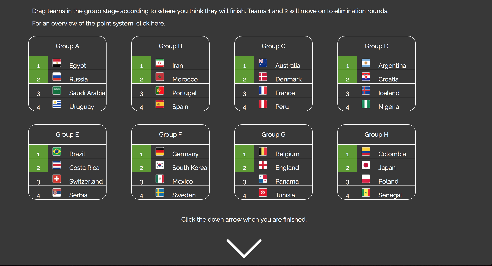
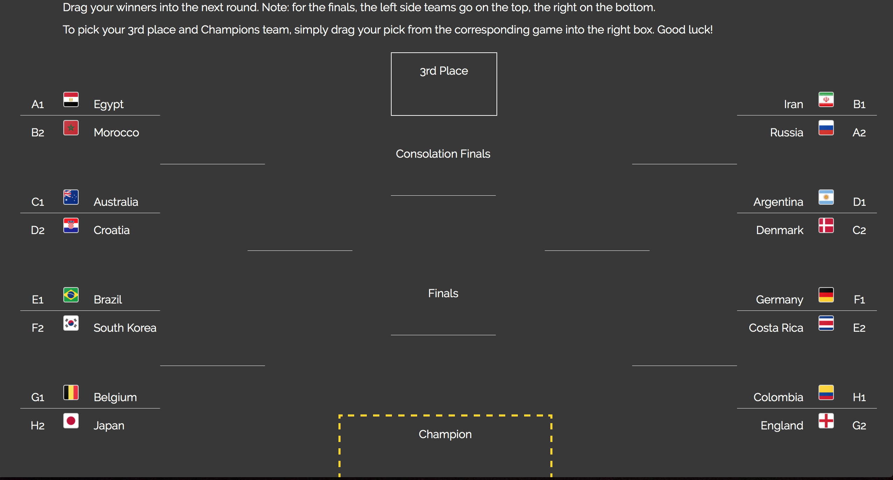
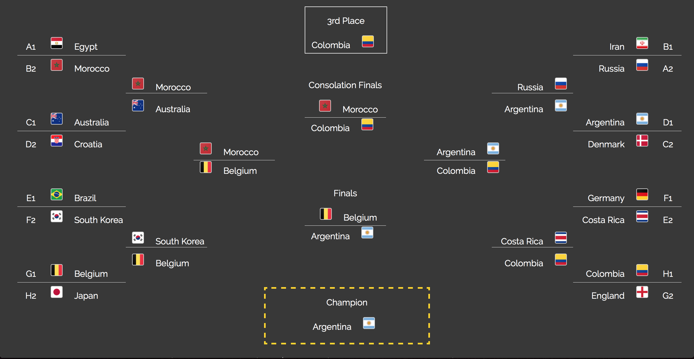

# worldCupPool
Customize your World Cup pool
 
This is what the initial group stage selection looks like

 
Once the down arrow is pressed, the following teams are populated accordingly

 
With some dragging and dropping, a complete pool is easier than ever!

